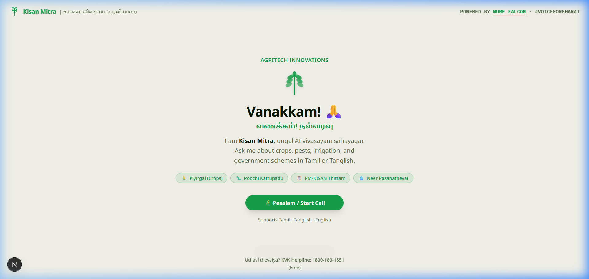
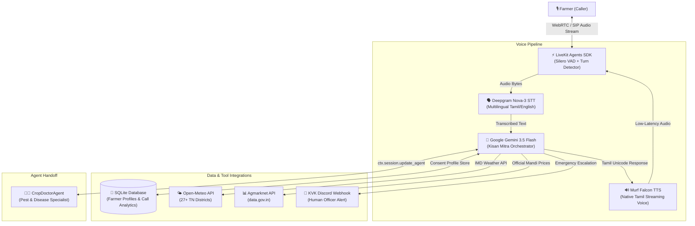
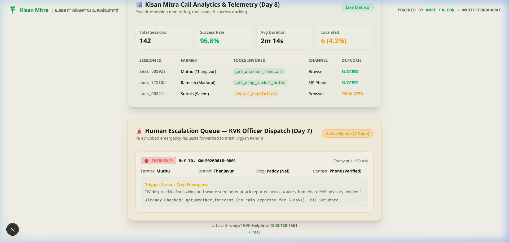
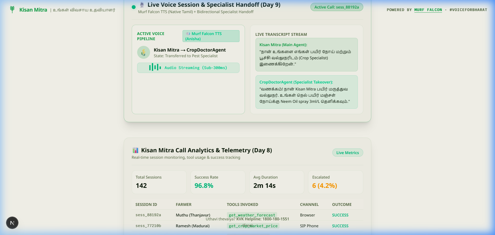

# Kisan Mitra (கான் மித்ரா) — AgriTech Voice AI Assistant

[](https://opensource.org/licenses/MIT) [](https://murf.ai/api/docs/text-to-speech/streaming) [](https://docs.livekit.io) [](https://deepgram.com) [](https://ai.google.dev/) [](https://murf.ai)

> **Kisan Mitra** is an ultra-low latency, multilingual voice AI assistant built for Tamil Nadu farmers. Powered by **Murf Falcon TTS**, **LiveKit Agents**, **Deepgram Nova-3**, and **Google Gemini**, it provides real-time mandi prices, weather forecasts, explicit-consent memory, human officer escalations, and specialist crop doctor handoffs over natural voice conversations in Tamil and English.

Built as part of the **10 Days of Voice Agents — VoiceForBharat Edition** challenge by Murf AI.

---



---

## 🌾 Why Kisan Mitra?

In rural India, millions of farmers struggle with critical agricultural decisions due to digital and literacy barriers:
- **Unpredictable Mandi Prices:** Farmers sell produce without knowing live wholesale prices, risking financial losses.
- **Weather Uncertainty:** Applying expensive pesticides right before unexpected rain leads to wasted chemical inputs.
- **Complex Text Interfaces:** Traditional mobile apps require navigating English menus. Voice is the natural interface for field conditions.

**Kisan Mitra** solves this by offering a conversational voice assistant that speaks authentic Tamil, remembers caller context with explicit consent, fetches live government data, and seamlessly hands off plant disease queries to specialized crop doctors.

---

## 🛠️ Architecture & Data Flow



---

## 🚀 10-Day Building Journey Breakdown

### Day 1: Foundation & Low-Latency Murf Falcon TTS Integration
- Configured LiveKit Agents SDK with **Murf Falcon TTS** (`voice="Anisha"` / native Tamil locale) and Deepgram Nova-3 STT.
- Achieved sub-300ms end-to-end streaming audio latency.

### Day 2: Native Tamil Unicode Guardrails & Personality
- Solved Tanglish phonetic distortion by enforcing strict system prompt guardrails requiring all spoken Tamil output in **pure Tamil Unicode script** (`தமிழ் எழுத்து`):
  ```python
  # Guardrail snippet:
  "Whenever you speak Tamil, EVERY Tamil word MUST be written in Tamil Unicode script (e.g. வணக்கம் instead of 'Vanakkam')."
  ```

### Day 3: Frontend UI & Audio Visualizer
- Built Next.js web application utilizing **LiveKit Agents UI** components for real-time visual feedback (audio waveform, state badges, transcript stream).

### Day 4: Privacy-First Farmer Profile Memory (SQLite)
- Integrated an SQLite database (`backend/src/db.py`) to save farmer profiles (name, district, crops, land size, last discussed topic).
- **Hard Consent Mandate:** The agent *must* explicitly ask for permission aloud before saving any facts, and includes a `forget_farmer_profile` tool for instant data deletion.

### Day 5: Real-Data Tools (IMD Weather & Agmarknet Mandi Prices)
- Integrated `get_weather_forecast` via Open-Meteo for 27+ Tamil Nadu districts.
- Integrated `get_crop_market_price` fetching official wholesale mandi prices (₹/quintal) from Agmarknet (data.gov.in).

### Day 6: SIP Telephony & Voice Activity Tuning
- Tuned **Silero VAD** thresholds and configured `BVCTelephony` noise suppression for incoming phone calls via LiveKit SIP trunks.

### Day 7: Human Escalation & Discord Dispatch System
- Built `create_escalation` to handle severe crop emergencies (e.g., mass wilting, locust attacks) or missing market data for urgent decisions.
- Auto-scrubs sensitive PII (OTPs, Aadhaar, account numbers) using regex sanitization.
- Generates reference IDs (e.g., `KM-20260812-0001`) and fires a rich **Discord Webhook** alert to KVK (Krishi Vigyan Kendra) officers.

### Day 8: Telemetry & Call Analytics Dashboard
- Automated per-session call logs recording duration, channel (Browser vs SIP), tools called, topics discussed, and outcome status (`success` vs `failed`).



### Day 9: Stateful Specialist Agent Handoff
- Implemented live bidirectional handoff between main `Kisan Mitra` and `CropDoctorAgent` (Pest & Disease Specialist) using `ctx.session.update_agent()`.
- Preserves full caller context during handoff without asking repeated questions.



### Day 10: Evaluation & Comprehensive Documentation
- Built LLM-as-judge evaluation tests using LiveKit testing framework (`uv run pytest`).
- Released comprehensive blog post, documentation, and open-source starter repo.

---

## 🛠️ Project Structure

```
murf-livekit-starter/
├── backend/                     # Python voice agent (LiveKit + Murf Falcon)
│   ├── src/
│   │   ├── agent.py             # Main entrypoint — Kisan Mitra & CropDoctorAgent pipeline
│   │   ├── db.py                # SQLite database (Farmer profiles & Call analytics)
│   │   └── tools.py             # Open-Meteo Weather, Agmarknet Mandi & Discord Webhook tools
│   ├── tests/
│   │   └── test_agent.py        # LLM-judged evaluation tests
│   ├── pyproject.toml           # Python dependencies (managed via uv)
│   └── .env.example             # Environment template
├── frontend/                    # Next.js UI (LiveKit Agents UI)
│   ├── app/                     # Pages & LiveKit token API route
│   ├── components/              # Visualizers, connection controls, theme
│   ├── app-config.ts            # Branding & feature flags
│   └── package.json             # Node dependencies (pnpm / npm)
├── assets/                      # Screenshots & media assets
│   └── kisan_mitra_ui_screenshot.jpg
├── start_app.ps1                # All-in-one startup script (Windows PowerShell)
├── start_app.sh                 # All-in-one startup script (macOS / Linux)
└── README.md                    # Project documentation
```

---

## ⚡ Quickstart

### Prerequisites
- **Python 3.10+** with [`uv`](https://docs.astral.sh/uv/)
- **Node.js 18+** with `pnpm` or `npm`
- Free API keys for LiveKit Cloud, Murf AI, Deepgram, and Google Gemini

### 1. Clone Repository & Setup Environment
```bash
git clone https://github.com/murf-ai/murf-livekit-starter.git
cd murf-livekit-starter

# Copy environment files
cp backend/.env.example backend/.env.local
cp frontend/.env.example frontend/.env.local
```

Configure your `backend/.env.local`:
```env
LIVEKIT_URL=wss://your-livekit-project.livekit.cloud
LIVEKIT_API_KEY=your_livekit_api_key
LIVEKIT_API_SECRET=your_livekit_api_secret
MURF_API_KEY=your_murf_api_key
DEEPGRAM_API_KEY=your_deepgram_api_key
GOOGLE_API_KEY=your_gemini_api_key
DISCORD_WEBHOOK_URL=your_optional_discord_webhook_url
```

### 2. Start Application

**Option A — Automated Script (Recommended):**
```powershell
# Windows PowerShell
.\start_app.ps1
```
```bash
# macOS / Linux
chmod +x start_app.sh
./start_app.sh
```

**Option B — Manual Terminal Setup:**
```bash
# Terminal 1 — Backend Agent
cd backend
uv sync
uv run python src/agent.py dev

# Terminal 2 — Frontend UI
cd frontend
pnpm install
pnpm dev
```

Open **`http://localhost:3000`** in your browser and click **Connect** to start talking!

---

## 🧪 Testing & Evaluation

Run LLM-as-judge evaluation tests:
```bash
cd backend
uv run pytest
```
Tests evaluate agent friendliness, grounding, refuse-harmful behavior, and function calling without mocks.

---

## 🤝 Acknowledgments & References

- **Murf Falcon TTS:** [https://murf.ai/api/docs/text-to-speech/streaming](https://murf.ai/api/docs/text-to-speech/streaming)
- **LiveKit Agents SDK:** [https://docs.livekit.io/agents](https://docs.livekit.io/agents)
- **Deepgram STT:** [https://developers.deepgram.com](https://developers.deepgram.com)
- **Agmarknet Prices:** [https://agmarknet.gov.in](https://agmarknet.gov.in)
- **Open-Meteo Weather:** [https://open-meteo.com](https://open-meteo.com)

---

## 📜 License

Distributed under the MIT License. See `LICENSE` for details.
